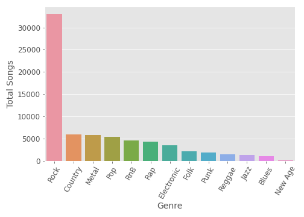

# Can musical genre be predicted from just the lyrics?

The goal of this project is to find out whether musical genre can be predicted from just the lyrics. Given the somewhat nebulous and subjective nature of musical genres, it is possible this is a doomed classification task. I will make the strongest model that I can, and along the way I will see what I can learn about the connection between genre and lyrics. 

All of the code necessary to follow along with this project is contained within the notebook **Genre_from_lyrics_notebook.ipynb** 

### Data Sources

A Bag-of-Words lyrics dataset was attained from http://millionsongdataset.com/musixmatch/ . This dataset contains the counts for the top 5000 words in 200,000+ songs. 

The specific file links are as follows

* Word Counts:
http://millionsongdataset.com/sites/default/files/AdditionalFiles/mxm_dataset_train.txt.zip
and
http://millionsongdataset.com/sites/default/files/AdditionalFiles/mxm_dataset_test.txt.zip

* Artist and Track information:
http://millionsongdataset.com/sites/default/files/AdditionalFiles/mxm_779k_matches.txt.zip

* Unstemmed words dictionary:
http://millionsongdataset.com/sites/default/files/mxm_reverse_mapping.txt

Genre data was attained from several sources

* Allmusic genre annotations: 
http://www.ifs.tuwien.ac.at/mir/msd/partitions/msd-MAGD-genreAssignment.cls

* Tagtraum majority/minority genre annotatins:
https://www.tagtraum.com/genres/msd_tagtraum_cd2.cls.zip

* Tagtrum unambiguous annotations (single genre):
https://www.tagtraum.com/genres/msd_tagtraum_cd2c.cls.zip

Full raw lyrics were scraped from https://genius.com/ 

### Load and process data

*data should be stored in the 'data' folder, but it is not provided in this repo. To follow along, download the data from the links above to the data folder in your repo*

After data is downloaded into the data folder (with the default file names from the data sources), data can be processed with the Process_data class. There are four class methods that must be completed in the right order to create the files necessary for this project.

*Note: These methods create and save several numpy and csv files in the data folder along the way. While these would ideally all be created and loaded into memory in one easy to run method, the memory requirements make that impractical. Files are saved along the way is so that I (and you!) can keep less of the data in memory at any one time*

**1) Process_data.load_data()**

**2) Process_data.make_tfidf()**

**3) Process_data.clean_counts()**

**4) Process_data.clean_tfidf()**

After these four methods have been run, separate TF-IDF and counts dataframes can be loaded with **Process_data.load_tfidf()** and **Process_data.load_counts()**. These dataframes contain the TF-IDF or counts for the top 1382 words (top 1500 minus stopwords). Column headings are reverse-mapped unstemmed words to make for cleaner data presentation, but the actual data refers to the word stems. There are 101,884 songs in this dataset - this is the number of songs from the lyrics dataset for which genre labels were available in the genres dataset.

### Scrape additional data

The TF-IDF and counts dataframes will be great for data exploration and most modeling (e.g. regression and random forest models), but they will not be useful for deep learning models like LSTM, which requires the actual lyrics in their original structure. The original data source (http://millionsongdataset.com/musixmatch/) does not contain the raw lyrics due to copyright concerns. This may seem backwards given that I already have clean vectorized lyrics, but I will scrape the raw lyrics for as many of these songs as possible.

Lyrics were scraped from Genius.com. See notebook (**Genre_from_lyrics_notebook.ipynb**) for detail on scraping the lyrics. Raw scraped lyrics are available in the data folder so you will not need to scrape the lyrics to follow along with processing the lyrics and running the model. 

I was able to successfully scrape the the raw lyrics for 70,273 of the 101,884 songs in the counts/tfidf dataframes. For consistency, all modeling and EDA was limited to these 70,273 songs.

Now we have 3 datasets to work with for our EDA and modeling. 

1) Word Counts - DataFrame with the counts of the top 1382 words

2) TF-IDF - DataFrame with TF-IDF score for the top 1382 words

3) Raw Lyrics - Dataframe with the lyrics as a string

## Exploratory Data Analysis

              
